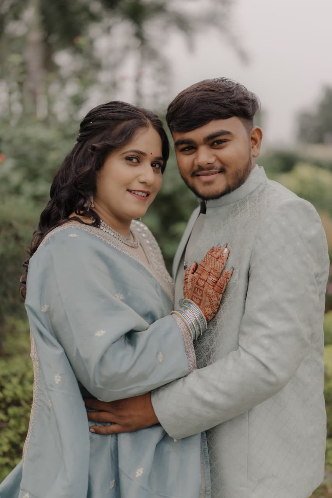

<!DOCTYPE html>
<html lang="en">
<head>
    <meta charset="UTF-8">
    <meta name="viewport" content="width=device-width, initial-scale=1.0">
    <title>Ruchit & Priya's Wedding</title>
    
    <link rel="preconnect" href="https://fonts.googleapis.com">
    <link rel="preconnect" href="https://fonts.gstatic.com" crossorigin>
    <link href="https://fonts.googleapis.com/css2?family=Great+Vibes&family=Open+Sans:wght@300;400;600;700&display=swap" rel="stylesheet">

    
</head>
<body>

    <header id="home">
        <nav>
            <ul>
                <li><a href="#home" class="active">Home</a></li> <li><a href="#events">Events</a></li>
                <li><a href="#gallery">Gallery</a></li>
            </ul>
        </nav>

        

            <h1>Ruchit ❤ Priya</h1>
            
06 DEC 2025

            <H3>"We invite you to celebrate our wedding"<H3>

            

        

            0
            Days
        

        

            0
            Hours
        

        

            0
            Minutes
        

        
    

            <a href="#" class="btn-main">View Livestream</a>
        

    </header>

    <main>
        <section id="events">
            <h2>Marriage Ceremonies</h2>
            

                     
                

                    <h3>GANESH STHAPAN</h3>
                    

                        📅 05th Dec 2025
                        🕒 08:00 AM
                    

                    <h4>AT OUR RESIDENCE</h4>
                    <a href="https://maps.app.goo.gl/yd2VBjmuptZoEWbRA?g_st=aw">Click For Address</a>
                

       
           
                

                    <h3>MAMERU</h3>
                    

                        📅 05th Dec 2025
                        🕒 10:00 AM
                    

                    <h4>AT OUR RESIDENCE</h4>
                    <a href="https://maps.app.goo.gl/yd2VBjmuptZoEWbRA?g_st=aw">Click For Address</a>
                

                

                    <h3>BHOJAN SAMARAMBH</h3>
                    

                        📅 05th Dec 2025
                        🕒 11:00 AM
                    

                    <h4>AT OUR RESIDENCE</h4>
                    <a href="https://maps.app.goo.gl/yd2VBjmuptZoEWbRA?g_st=aw">Click For Address</a>
                    

                 

                    <h3>GRAH SANTI</h3>
                    

                        📅 05th Dec 2025
                        🕒 01:00 PM
                    

                    <h4>AT OUR RESIDENCE</h4>
                    <a href="https://maps.app.goo.gl/yd2VBjmuptZoEWbRA?g_st=aw">Click For Address</a>
                   

                

                    <h3>VARGODO</h3>
                    

                        📅 05th Dec 2025
                        🕒 07:30 PM
                    

                    <h4>AT OUR RESIDENCE</h4>
                    <a href="https://maps.app.goo.gl/yd2VBjmuptZoEWbRA?g_st=aw">Click For Address</a>
                    

                

                    <h3>JAAN PRASTHAN</h3>
                    

                        📅 06th Dec 2025
                        🕒 09:30 AM
                    

                    <h4>AT OUR RESIDENCE</h4>
                   <a href="https://maps.app.goo.gl/yd2VBjmuptZoEWbRA?g_st=aw">Click For Address</a>
                    

                

                    <h3>HAST MELAP</h3>
                    

                        📅 06th Dec 2025
                        🕒 12:39 PM
                    

                    <h4>GAYATRI MANDIR HALL</h4>
                    
                     <a href="https://maps.app.goo.gl/LrfYLEMrQ6uxD1SB8?g_st=aw">Click For Address</a>
                    

                 

                    <h3>RECEPTION VENUE</h3>
                    

                        📅 08th Dec 2025
                        🕒 06:00 PM
                    

                    <h4>SAPTSRUNGI PARTY PLOT</h4>
                     <a href="https://maps.app.goo.gl/aNvEGUtDKKNqi9zy5?g_st=aw">Click For Address</a>
                 

               
            

        </section>

        <section id="gallery">
            <h2>Gallery</h2>
            

                
                
                
                
                

        </section>
    </main>

    <a href="#home" class="back-to-top">↑</a>

 

    </body>
</html>

